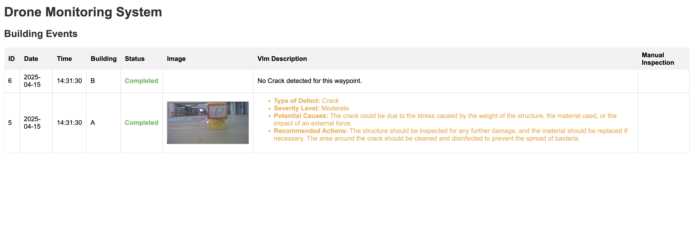

# RotomBot: Autonomous Drone for Civil Infrastructure Inspection

**Team Members**: Ethan Rajah, Andrew Jairam, Gurpreet Mukker, Arthur Zhuang  
**Capstone Project – ROB498, University of Toronto, 2025**

  
  

RotomBot is a low-cost, autonomous drone designed to detect and describe structural cracks in civil infrastructure using onboard and offboard ML models. Users can specify inspection points via voice commands, which are transcribed using a speech-to-text model and converted into waypoint instructions for the drone. Leveraging a YOLO-based crack detection model and a vision-language model (VLM) for natural language descriptions, the system provides human-readable summaries of structural health and stores results in a structured SQL database accessible through a web interface. The VLM bridges the gap between raw model outputs and actionable insights, making the system accessible to non-technical users. It enables quick triaging by categorizing cracks by type and severity, helping engineers and reviewers prioritize critical issues efficiently during structural assessments.

## 🚁 Key Features

- **Autonomous Navigation** using ROS2 and a PX4-based flight controller
- **Speech-to-Text Waypoint Control** using OpenAI Whisper
- **Crack Detection** with a fine-tuned YOLOv4 Tiny model
- **Visual Description** using SmolVLM2 (2.2B parameter VLM) for severity classification and mitigation suggestions
- **Web-Based SQL Database** for storing images, inspection metadata, and recommendations
- **Obstacle Avoidance** with a potential field algorithm
- **User-Friendly Interface** to view results and prioritize inspections

## 🧠 System Architecture

### Onboard (Drone)

- **Jetson Nano** (4GB RAM, 128 CUDA cores)
- **PX4 Cube Orange+** flight controller
- **IMX219-160 Monocular Camera** (1080p)
- **ROS2 Foxy** for robot middleware
- **OpenCV + GStreamer** for camera image processing
- **YOLOv4-Tiny** crack detection
- **State Machine** with 6 states: `IDLE`, `CAPTURING`, `INFERENCING`, `SENDING`, `DONE`, `ERROR`
- **Basic Obstacle Avoidance** using repulsive potential fields

### Offboard (Laptop)

- **Speech Recognition**: Whisper (1.5B parameter model)
- **VLM**: SmolVLM2 via MLX (Apple Silicon optimized)
- **API**: Python Flask backend
- **Database**: SQL with structured entries for job ID, site, image, description, severity, and recommendations
- **Web UI**: HTML-based

## 🗺️ Workflow

1. **Voice Command** → Transcribed by Whisper → Parsed for waypoints
2. **Waypoint Fetch** → API sends coordinates to onboard drone
3. **Autonomous Flight** → Waypoint navigation with obstacle avoidance
4. **Image Capture** → Undistortion → Crack detection with YOLO
5. **If Crack Detected** → Image sent to VLM → SQL entry created
6. **Web Dashboard** → Browse crack descriptions, images, and severity levels

## 📊 Performance

| Metric                         | Result                        |
|-------------------------------|-------------------------------|
| Crack Detection Accuracy      | 95% on 20 test images         |
| VLM Output Consistency        | 100% task-aligned responses   |
| Obstacle Avoidance Accuracy   | < 0.1m drift (X, Y, Z)        |
| Battery Replacement Time      | ~15 seconds                   |
| Deployment Cost               | ~$1,500 CAD total             |

## 🤖 Testing

- Simulated inspections with printed cracks on cardboard
- VICON-based localization for indoor flight validation
- Tested under varying lighting conditions
- External validation by engineers in nuclear, mechanical, and materials domains

## 🧱 Stack

| Domain               | Technology                     |
|---------------------|---------------------------------|
| Flight Control       | PX4 Cube Orange+               |
| Autonomy             | ROS2 Foxy + MAVROS             |
| CV Inference         | YOLOv4 Tiny (Darknet)          |
| Language Inference   | SmolVLM2 (Hugging Face)        |
| Speech Recognition   | Whisper (OpenAI)               |
| API + Backend        | Flask + SQL                    |
| Camera               | IMX219 (1080p)                 |
| Frontend             | HTML                           |

## ⚠️ Design Constraints

- Jetson Nano compute limits (max CUDA 10.2)
- VLM and Whisper must run offboard due to 4GB RAM limit
- Requires pre-mapped obstacles and waypoints
- VICON-based localization (for testing; SLAM or GPS recommended for real-world deployment)

## Demo Video Link

